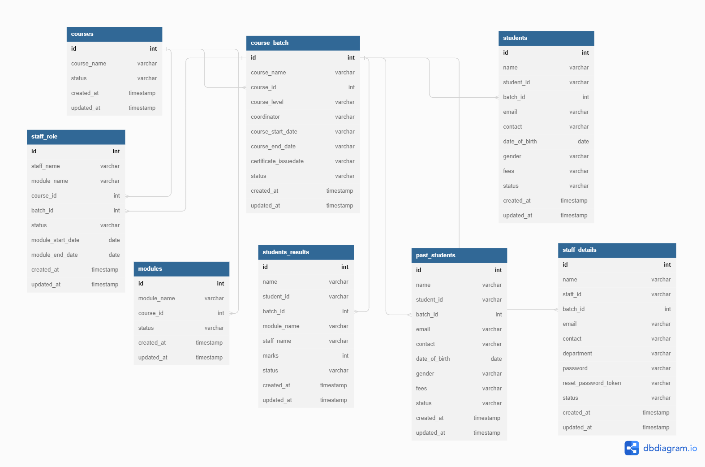
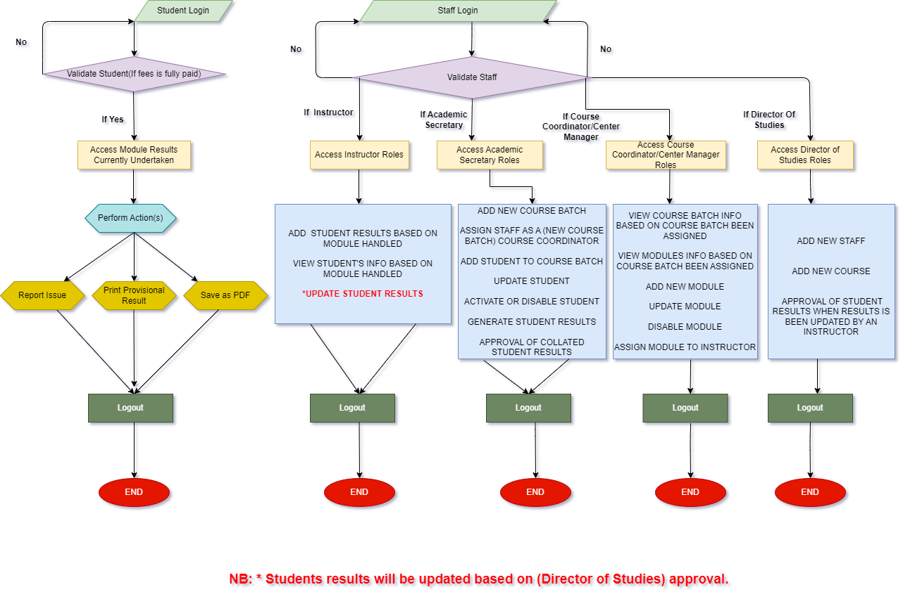

# UNFINISHED WORKS THAT NEED TO BE DONE

1. If you want to add a new Course Batch. Select for the Course Coordinator is not working.
(Have created an endpoint on the Staff Controller(staffs/getInstructors)).
2. Creation of new form called(Email Verification Form). This form will allow the staffs to
enter only their email and an email verification link will be sent to their email for them to 
reset their password before they can login.
(Have created an endpoint that sends the reset password link (staffs/sendResetPasswordLinkToStaffEmail))
3. Creation of another form called(Reset Password Form). So after the staff clicks on the email
verification link inside the email. It will redirect them to this Reset Password Form.
4. Error under Students(Selecting Past Students under each Course Batch). 
Endpoint (pastStudents/findPastStudentsUnderCourseBatch).
5. Add Center Manager as Usertype. Center Manager and Course Coordinator has the same role.
6. Add View Course Batches Under Each Course. Endpoint (courseBatch/findAllCourseBatchesUnderEachCourse).

# CHANGES ON THE DATABASE

# CHANGES ON THE FLOWCHART

